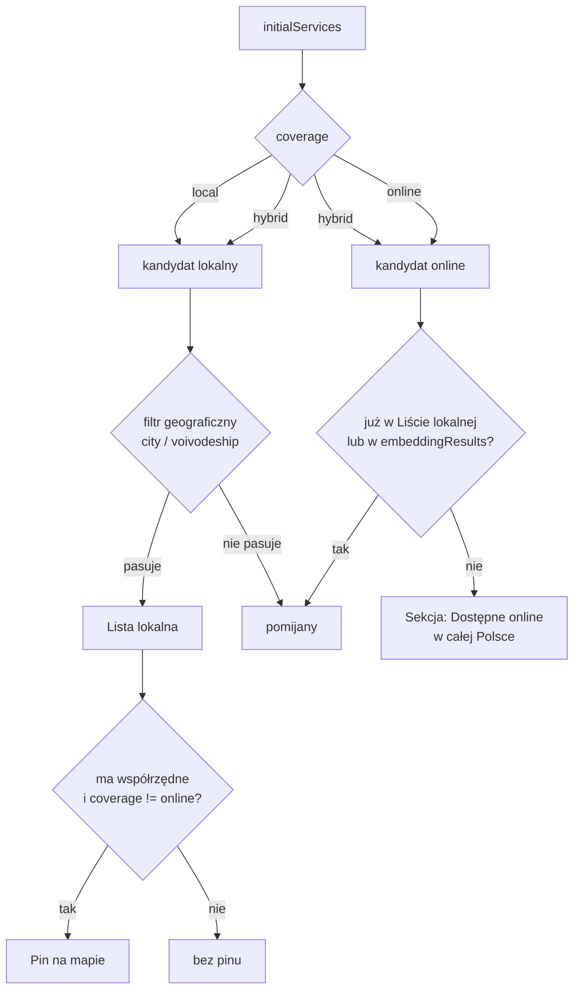

# feat: Zasięg usługi (lokalna / online / hybryda)

## Przegląd

Wprowadzamy **zasięg** jako drugą, ortogonalną oś opisu wpisu — obok kategorii (branży).
Wpis jest `local`, `online` albo `hybrid`. Mapa przestaje być jedyną bramką odkrywania:
usługi świadczone zdalnie dostają własną sekcję na liście, własny filtr i własny indeksowalny URL,
a piny na mapie zostają wyłącznie tam, gdzie faktycznie można przyjść.

Kategoria **nie** zyskuje wartości `online` — to była świadomie odrzucona alternatywa
(zob. źródło: `docs/brainstorms/2026-08-19-uslugi-online-zasieg-requirements.md`).

## Ujęcie problemu

Cała discovery w Polvii przechodzi przez mapę opartą na współrzędnych. Dla usług zdalnych ten model
działa przeciw użytkownikowi. Przypadek wzorcowy — **fotodokarty.com.pl**: zdjęcia biometryczne na
kartę pobytu CUKR, upload selfie → JPG mailem w ~20 s, zasięg cała Polska, adres rejestrowy
w Warszawie **bez punktu stacjonarnego**.

Pin na tym adresie kłamie („przyjdź tu") i jednocześnie ukrywa wpis przed właściwymi ludźmi —
filtrowanie odcina po `s.voivodeship` / `s.city`, więc użytkownik w Rzeszowie tej usługi nie zobaczy.

Podaż już istnieje i już jest marnowana: w `src/db/seed.ts` siedzi kilka biur rachunkowych opisanych
jako „księgowość online", „obsługa online w całej Polsce", „Remote service across Poland" —
zapisanych jako zwykłe wpisy lokalne w kategorii `financial`.

## Śledzenie wymagań

Wymagania przeniesione 1:1 z dokumentu źródłowego.

- **R1.** Zasięg w trzech stanach: `local` (domyślny), `online`, `hybrid`; niezależny od kategorii.
- **R2.** Kategoria pozostaje branżą; „online" nie staje się wartością kategorii.
- **R3.** Pin na mapie wyłącznie dla wpisów, które można odwiedzić (`local`, `hybrid`).
- **R4.** Sekcja „Dostępne online w całej Polsce (N)" pod wynikami lokalnymi, widoczna zawsze.
- **R5.** Wpisy `online` i `hybrid` nie są odfiltrowywane przez filtr geograficzny.
- **R6.** Sekcja online zawiera tylko wpisy, których nie ma już w liście lokalnej.
- **R7.** Filtr „Online" w rzędzie filtrów, kombinowalny z kategorią.
- **R8.** Indeksowalne URL-e `/mapa/online` i `/mapa/{kategoria}/online`, slug `online` we wszystkich locale.
- **R9.** Dla `online` miasto wymagane; ulica i współrzędne opcjonalne.
- **R10.** Karta `online` / `hybrid` nosi widoczne oznaczenie zasięgu.
- **R11.** Mobile: widok „mapa" bez żadnego pinu → empty state kierujący do listy.
- **R12.** Migracja danych: wpisy zdalne z seeda → `hybrid`; FotoDoKarty → `online`.

## Granice scope'u

Przeniesione z dokumentu źródłowego:

- Bez osobnej gałęzi route `/uslugi-online`.
- Bez pinów zastępczych (centroidy województw, „środek Polski", pin online).
- Bez zasięgu regionalnego — `online` znaczy „cała Polska".
- Bez sekcji online na stronie głównej (`category-preview` bez zmian).
- Bez naprawy kategorii `government` (osobna, wcześniejsza luka — patrz Ryzyka).
- Bez nowej wartości w `categoryEnum`.

Dodane w planowaniu:

- Bez zmian **w logice** `/api/services` (semantic search) — uzasadnienie w Kluczowych decyzjach.
  **Sprostowanie z wykonania U1:** pola selecta i ręcznie przepisywany obiekt odpowiedzi **musiały**
  dostać `coverage`, bo route zwraca współdzielony typ `PartialService`. Granica dotyczy zachowania
  (brak filtrowania po zasięgu, brak nowych parametrów), nie kształtu wiersza.
- Bez `/mapa/{kategoria}/online` w sitemapie w tej iteracji — tylko `/mapa/online`.
- Bez konsolidacji czterech źródeł prawdy o kategoriach — zgłoszone jako ryzyko, nie naprawiane tutaj.

## Kontekst i research

### Relevantny kod i wzorce

- **`src/app/[locale]/(main)/_components/map-list/map-list.tsx`** — kluczowy wzorzec. Ma już
  lokalny komponent `SectionHeader` i renderuje **dwie** sekcje (wyniki filtrowane + `embeddingResults`
  pod nagłówkiem „Also recommended") w `renderServiceCards()`, ze wspólnym licznikiem `cardIndex`
  i tablicą `allServices` dla refów/scrollowania. Sekcja online to trzecia sekcja w tym samym wzorcu.
- **`src/app/[locale]/(main)/_components/services-client-component.tsx`** — `frontendFilteredServices`
  (useMemo, filtrowanie po `query` / `city` / `voivodeship` / `category`). Plik ma 681 linii, czyli
  ponad próg 300 z `coding-rules.md` — logika kubełkowania idzie do `src/lib/`, nie do tego pliku.
- **`src/lib/map-slug-parser.ts`** — `parseMapSlug` przyjmuje maks. 2 segmenty; `parseTwoSegments`
  wymaga kategorii jako pierwszego segmentu, drugi to county **lub** city. To slot dla `online`.
- **`src/lib/map-url-builder.ts`** — `buildMapUrl` wypełnia ten sam slot (`county` → `else if city`).
- **`src/lib/slug-mappings.ts`** — `isValidCountySlug`, `isValidCitySlug`, `getCategoryFromSlug`;
  `online` nie koliduje z żadnym istniejącym slugiem kategorii, county ani miasta.
- **`src/app/[locale]/(main)/_components/overview-map/utility.ts`** — `createPoints` mapuje 1:1
  na `createPoint`, bez filtrowania. Tu wchodzi wykluczenie wpisów bez pinu.
- **`src/app/[locale]/(main)/_components/service-card/service-card.tsx`** — `Badge` +
  `mapCategoryToBadgeColor`, `VerifiedBadge` jako wzorzec dodatkowego oznaczenia, `formatAddress`
  / `addressParts`, `getTodayHours`.
- **`src/app/[locale]/(dashboard)/dashboard/_actions.ts`** — `serviceSchema` (Zod);
  `categoryValues = categoryEnum.enumValues` — wartości enuma płyną do walidacji automatycznie,
  więc nowy `coverageEnum` też się podłączy bez ręcznego duplikatu.
- **`src/components/ui/badge/badge.test.tsx`** — wzorzec testu: Jest + RTL + `jest-axe`
  z `expect.extend(toHaveNoViolations)`.
- **`src/app/[locale]/(main)/_components/map-list/empty-state.tsx`** — gotowy `EmptyState` dla R11.

### Wiedza instytucjonalna

`docs/solutions/` ma strukturę katalogów, ale **zero plików `.md`** — brak zapisanych wniosków
do wykorzystania. Pierwszy wpis powstanie z `/dev-compound` po tym zadaniu.

### Referencje zewnętrzne

Research zewnętrzny pominięty świadomie: zmiana opiera się w całości na wzorcach istniejących
w repo (sekcje listy, slug parser, Drizzle enum, Zod w Server Action), nie dotyka płatności,
bezpieczeństwa ani zewnętrznych API. Jedyny input zewnętrzny to `fotodokarty.com.pl` jako
przypadek referencyjny — sprawdzony podczas brainstormu.

## Kluczowe decyzje techniczne

- **`coverage` na `servicesTable`, nie na `serviceLocationsTable`**: zasięg opisuje ofertę firmy,
  nie punkt. Firma z dwoma biurami obsługująca zdalnie ma jeden zasięg (`hybrid`) i dwa piny.
  Trzymanie tego na lokalizacji wymuszałoby uzgadnianie sprzecznych wartości między wierszami.
  Kategoria już mieszka na `servicesTable`, więc obie osie są obok siebie.
- **`innerJoin` w `getServices` **zostaje** — dokument źródłowy zakładał zmianę na `leftJoin`;
  planowanie ustala, że jest niepotrzebna.** `serviceLocationsTable` niesie **wymagany, unikalny
  `slug`** (identyfikator wpisu w URL i w selekcji karty) oraz `city` wymagane przez R9 — więc
  każdy wpis, także w pełni zdalny, zawsze ma wiersz lokalizacji. Nullowalne są tylko współrzędne.
  To zdejmuje z planu ryzykowną zmianę semantyki joinu w dwóch dużych zapytaniach.
- **`openingHours` zostaje `notNull`** — dokument źródłowy odraczał to pytanie. Dla wpisu zdalnego
  używamy `{}`, co spełnia `notNull` bez migracji. `getTodayHours` zwraca wtedy `null`, a karta
  renderuje blok godzin pod `{todayHours && (...)}` (`service-card.tsx:480`) — czyli już jest
  null-safe i nie wymaga zmiany. Zero kosztu.
- **Logika kubełkowania jako czysta funkcja w `src/lib/service-coverage.ts`**, nie inline
  w `services-client-component.tsx`: plik ma już 681 linii, a reguły R4/R5/R6 to dokładnie ten typ
  logiki, który musi mieć testy jednostkowe. Funkcja bierze listę + filtry i zwraca trzy kubełki.
- **Deduplikacja (R6) liczona względem sumy `frontendFilteredServices` ∪ `embeddingResults`**,
  nie tylko listy lokalnej. Inaczej usługa zdalna wyciągnięta przez semantic search pokazałaby się
  dwa razy na jednym ekranie — raz w „Also recommended", raz w sekcji online.
- **Bez zmian w `/api/services`**: sekcja online jest budowana klienckim filtrem po `coverage`
  z tej samej listy `initialServices`, którą komponent już ma. Route embeddingowy zostaje
  nietknięty (jego `innerJoin` i warunek `embedding IS NOT NULL` działają dalej), a jego wyniki
  wchodzą tylko do reguły dedupe. Najmniejsza możliwa zmiana spełniająca R4.
- **`online` zajmuje slot lokalizacji w URL, nie trzeci segment**: `parseMapSlug` zostaje przy
  limicie 2 segmentów. `/mapa/online` i `/mapa/prawne/online` działają w istniejącym kształcie.
  `/mapa/pomorskie/online` odpada samo — `parseTwoSegments` wymaga kategorii jako pierwszego
  segmentu i przekierowuje na `basePath`. Nie trzeba pisać nowej reguły odrzucania.
- **Piny wyklucza się na etapie `points`, nie w `MapFilters`**: warunek „ma współrzędne
  i `coverage !== 'online'`" jest własnością renderu mapy, nie filtra danych. Lista i mapa dostają
  tę samą listę usług, mapa sama pomija to, czego nie umie pokazać. Filtr `hybrid` dostaje pin
  automatycznie, bez wyjątku w kodzie.
- **Sortowanie w sekcji online przychodzi darmo** — założenie z dokumentu źródłowego („jak w liście
  lokalnej: promowane, potem klikalność") jest spełnione bez dodatkowej pracy: `getServices` już
  sortuje po `COALESCE(promoted.priority)` i `COALESCE(clicks)`, a kubełkowanie tylko filtruje tę
  listę, zachowując kolejność. Nie dodawać własnego sortowania w `service-coverage.ts`.
- **`Weryfikacja:` wyłącznie CLI** — projekt nie ma `.env.e2e`, więc zgodnie z regułą harnessu
  scenariusze przeglądarkowe są `[Manual]` w `Operator checklist`. Warunkiem odblokowania
  automatycznego E2E jest utworzenie `.env.e2e` — zapisane w Ryzykach.

## Otwarte pytania

### Rozwiązane podczas planowania

- **Czy zasięg należy do `services` czy `service_locations`?** → `services`. Zasięg to własność
  oferty firmy; lokalizacje pozostają czystym zbiorem punktów.
- **Jaki jest realny zakres skutków nullowalnych współrzędnych?** → Węższy niż zakładał dokument
  źródłowy. `innerJoin` zostaje (lokalizacja zawsze istnieje z powodu `slug` + `city`).
  Dotknięte: `schema.ts`, migracja, `types/index.ts` (`latitude`/`longitude` → `number | null`),
  `createPoint`/`createPoints`, gardy i `navigateLink` w `service-card.tsx`, Zod w `_actions.ts`,
  `service-form.tsx`. **Zapytania nie zmieniają semantyki, tylko dodają kolumnę `coverage`.**
- **Co z `openingHours` przy obsłudze zdalnej?** → Bez migracji; `{}` dla wpisów zdalnych,
  karta już to obsługuje null-safe.
- **Czy `/api/services` (embeddingi) musi znać zasięg?** → Nie w tej iteracji; jego wyniki wchodzą
  wyłącznie do reguły deduplikacji.
- **Czy `/mapa/{kategoria}/online` wchodzi do sitemapy?** → Nie w tej iteracji. Obecna polityka
  sitemapy świadomie pomija kombinacje kategoria+lokalizacja jako thin content
  (`src/app/sitemap.ts`, komentarz przy sekcji 6), a dopóki większość kategorii ma zero usług
  zdalnych, 14 kombinacji × 2 locale to dokładnie thin content. Wchodzi tylko `/mapa/online`.
  Rozszerzenie po pojawieniu się podaży, gated licznikiem.
- **Czy `online` koliduje z istniejącymi slugami?** → Nie. Sprawdzone wobec `CATEGORY_SLUGS`
  (4 locale), `COUNTY_SLUGS` i `CITY_SLUGS`.
- **Nazwa filtra w UI** → „Online" (założenie z dokumentu źródłowego, utrzymane).

### Odroczone do implementacji

- **Dokładny kształt propsów `MapList`** — czy `onlineResults` idzie osobnym propem, czy jako
  część jednego obiektu `buckets`. Zależy od tego, jak wygodnie ułoży się `cardIndex` przy trzech
  sekcjach; widoczne dopiero w kodzie.
- **Czy `MapFilters.onlineOnly` wystarczy jako boolean**, czy potrzebny jest wariant
  `coverage: 'online' | null` dla przyszłego zasięgu regionalnego. Rozstrzygnąć przy pisaniu parsera —
  nie tworzyć abstrakcji na zapas (regionalny zasięg jest poza scope'em).
- **Czy `resetAllFilters` w `filter-component.tsx` ma zerować `online`** razem z resztą — zależy
  od tego, czy chip online wyląduje w tym samym rzędzie scrollowanym co kategorie, czy obok niego.
- **Nazwy kluczy i18n** w `MapList` / `MapPage.Categories` — ustalić przy edycji `messages/*.json`,
  utrzymując istniejącą konwencję (`snake_case` w `MapList`, `PascalCase` w `Categories`).
- **Czy `generate-embeddings` wymaga zmiany** dla wpisów bez współrzędnych — embedding liczy się
  z opisu i tagów, ale skrypt trzeba przejrzeć pod kątem założeń o adresie.

## Diagram: kubełkowanie wyników (R4, R5, R6)

Wpis `hybrid` jest kandydatem do obu kubełków, ale reguła dedupe (R6) gwarantuje, że wyląduje
dokładnie w jednym: w liście lokalnej, gdy pasuje geograficznie, w sekcji online, gdy nie pasuje.

## Implementation Units

### Faza 0 — Odblokowanie weryfikacji

- [ ] **Unit 0: Czysty baseline typecheck**

**Cel:** Doprowadzić `npx tsc --noEmit` do zera błędów, żeby checkboxy `Weryfikacja:` w kolejnych
unitach dały się w ogóle domknąć.

**Wymagania:** Żadne — unit enabling. Bez niego każda `Weryfikacja:` w tym planie jest z definicji `[ ]`.

**Zależności:** Brak.

**Pliki:**
- Stwórz: `src/components/ui/badge/index.ts`
- Stwórz: `src/components/ui/button/index.ts`

**Delegate to:** feature-builder-web-ui

**Skills in play:** nextjs-stack-guidelines

**Podejście:**
- `badge.test.tsx` i `button.test.tsx` importują z `@/components/ui/badge` / `@/components/ui/button`,
  a te katalogi nie mają barrel file'a. To jedyne dwa błędy typecheck w repo (potwierdzone,
  stan 2026-08-19; udokumentowane w `CLAUDE.md`).
- Re-eksportuj publiczne API każdego komponentu z jego pliku `<nazwa>.tsx`. Nie zmieniaj testów —
  brakuje pliku produkcyjnego, nie test jest zły.

**Wzorce do naśladowania:**
- Konwencja z `CLAUDE.md`: „Komponent z testem/stories = folder: `nazwa/nazwa.tsx`".

**Scenariusze testowe:**
- [Unit] `badge.test.tsx` i `button.test.tsx` przechodzą bez zmian w plikach testowych.

**Weryfikacja:**
- `npx tsc --noEmit` kończy się zerem błędów.
- `npx jest src/components/ui/badge src/components/ui/button` — wszystkie testy przechodzą.

---

### Faza 1 — Fundament danych

- [x] **Unit 1: `coverage` w schemacie + nullowalne współrzędne + typy + zapytania** — commit `f7e7b87`, migracja pending

**Cel:** Wprowadzić zasięg do modelu danych i dopuścić wpis bez współrzędnych, nie zmieniając
semantyki istniejących zapytań.

**Wymagania:** R1, R9

**Zależności:** Unit 0 (żeby weryfikacja typecheck była wiarygodna)

> **Sprostowanie z wykonania:** pierwotny podział był błędny — zdjęcie `notNull` ze współrzędnych
> psuje kompilację u konsumentów, więc U1 **nie mógł** być samodzielnym zielonym commitem, a jego
> kryterium „tsc zero błędów" było strukturalnie nieosiągalne. Decyzją użytkownika U1 wchłonął
> minimalne poprawki kompilacyjne (`!= null`, predykaty typu) w plikach U7/U8. Unity 7 i 8 zachowują
> całą warstwę **zachowania** — patrz notatki w ich sekcjach.

**Pliki:**
- Modyfikuj: `src/db/schema.ts`
- Stwórz: `drizzle/00XX_*.sql` *(generowany przez `npx drizzle-kit generate` — `npm run drizzle:generate` jest martwy, woła przedawniony `generate:pg`; NIGDY nie edytowany ręcznie)*
- Modyfikuj: `src/types/index.ts`
- Modyfikuj: `src/lib/queries.ts`
- Modyfikuj: `src/lib/map-utils.ts` *(dopisane w wykonaniu — przeoczone w planowaniu; predykat typu w filtrze, zero zmiany zachowania)*
- Modyfikuj: `src/app/api/services/route.ts` *(dopisane w wykonaniu — `coverage` w selekcie i w przepisywanym obiekcie; wymóg współdzielonego typu, nie zmiana logiki)*
- Modyfikuj: `src/app/[locale]/(main)/_components/overview-map/utility.ts` *(wchłonięte: typ `LocatedService` + filtr braku współrzędnych; warunek `coverage` zostaje w U7)*
- Modyfikuj: `src/app/[locale]/(main)/_components/service-card/service-card.tsx` *(wchłonięte: gardy `!= null`; badge i `navigateLink` zostają w U8)*
- Modyfikuj: `src/app/[locale]/(main)/_components/marker-popup.tsx` *(wchłonięte: early return bez współrzędnych)*
- Test (unit): `src/db/schema.test.ts` *(guard na wartości `coverageEnum` — łapie przypadkową zmianę nazwy wartości, od której zależą parser URL, Zod i filtry)*

**Delegate to:** feature-builder-web-data

**Skills in play:** nextjs-stack-guidelines, security

**Podejście:**
- Nowy `coverageEnum` = `pgEnum('coverage', ['local', 'online', 'hybrid'])`.
- Kolumna `coverage` na `servicesTable`, `notNull().default('local')` — istniejące wiersze dostają
  poprawną wartość bez ręcznego backfillu.
- `serviceLocationsTable.latitude` / `longitude` tracą `notNull()`. **Indeksy
  `idx_location_latitude` / `idx_location_longitude` zostają** — Postgres indeksuje NULL-e
  bez problemu, a zapytania geograficzne dalej z nich korzystają.
- `getServices` i `getMostPopular`: dodać `coverage: servicesTable.coverage` do selecta.
  **`innerJoin` na `serviceLocationsTable` zostaje bez zmian** — uzasadnienie w Kluczowych decyzjach.
- `types/index.ts`: `Service.latitude: number | null`, `Service.longitude: number | null`,
  nowe `Service.coverage: Coverage`, gdzie `Coverage` inferowany ze schematu Drizzle
  (`(typeof coverageEnum.enumValues)[number]`), nie pisany ręcznie.
- Migracja wyłącznie przez `npm run drizzle:generate`.

**Notatka wykonawcza:** Po zmianie typu `latitude`/`longitude` na nullowalny `npx tsc --noEmit`
ujawni wszystkie miejsca zakładające `number`. Ta lista błędów jest mapą pracy dla Unitów 6–7 —
przejrzyj ją i odnotuj, zanim zaczniesz gasić pojedyncze przypadki.

**Wzorce do naśladowania:**
- `statusEnum` / `categoryEnum` w `src/db/schema.ts` — kształt enuma i wartości domyślnej.
- `src/db/aliases.ts` — jeśli potrzebny alias.

**Scenariusze testowe:**
- [x] [Unit] Typ `Coverage` przyjmuje `'local' | 'online' | 'hybrid'` i odrzuca inne wartości
  (test typu przez `@ts-expect-error` albo asercja na `coverageEnum.enumValues`) — **4/4 PASS**

**Weryfikacja:**
- [x] `npx tsc --noEmit` kończy się zerem błędów po zaktualizowaniu wszystkich miejsc użycia — **0**
- [x] `npx jest src/lib` — testy przechodzą — **95/95 w całym repo**
- [x] `npx next lint` — zero błędów (`eslint-plugin-drizzle` bez ostrzeżeń na zmianach schematu) — **0**
- [ ] `git diff --stat drizzle/` pokazuje wyłącznie nowy plik migracji, zero modyfikacji istniejących
      — **czeka na wygenerowanie migracji (wymaga TTY, patrz zadania.md)**

**Operator checklist:**
- [ ] `npm run drizzle:push` (albo `npx tsx sequential-migrate.ts`) na lokalnej bazie dev
- [ ] Potwierdzić, że kolumna `coverage` istnieje i ma domyślne `'local'` dla wszystkich istniejących wierszy

---

### Faza 2 — Wejście danych

- [ ] **Unit 2: Zasięg w dashboardzie (formularz + Server Action + Zod)**

**Cel:** Umożliwić dodanie i edycję wpisu z zasięgiem, w tym wpisu zdalnego bez ulicy i współrzędnych.

**Wymagania:** R1, R9

**Zależności:** Unit 1

**Pliki:**
- Modyfikuj: `src/app/[locale]/(dashboard)/dashboard/_actions.ts`
- Modyfikuj: `src/app/[locale]/(dashboard)/dashboard/_components/service-form.tsx`
- Modyfikuj: `src/app/[locale]/(dashboard)/dashboard/_components/services-table.tsx` *(kolumna zasięgu)*
- Test (unit): `src/app/[locale]/(dashboard)/dashboard/_actions.test.ts`

**Delegate to:** feature-builder-web-fullstack

**Skills in play:** nextjs-stack-guidelines, security

**Podejście:**
- Formularz i akcja są tu nierozdzielne: pole `coverage` bez walidacji przepuszcza śmieci,
  a walidacja bez pola nie ma czego sprawdzać. To dokładnie przypadek z reguły wyboru subagenta.
- Zod: `coverage: z.enum(coverageValues)` z `coverageValues = coverageEnum.enumValues` — ten sam
  wzorzec, którym `_actions.ts` już czerpie `categoryValues` / `statusValues` / `voivodeshipValues`.
- `latitude` / `longitude`: z wymaganych `z.coerce.number()` na opcjonalne. Uwaga na pusty string
  z `FormData` — `z.coerce.number()` zamienia `''` na `0`, co dałoby pin w Zatoce Gwinejskiej.
  Puste wejście musi dawać `null`, nie `0`. To jest sedno tego unitu.
- Walidacja krzyżowa przez `.superRefine()` (albo `.refine()`): gdy `coverage !== 'local'` →
  `city` wymagane. Gdy `coverage === 'local'` → `latitude` i `longitude` wymagane (bez pinu wpis
  lokalny jest bezużyteczny).
- Wpis o `coverage === 'online'` zapisuje `openingHours: {}`.
- Formularz: select zasięgu obok selecta kategorii; gwiazdka „*" przy `Latitude`/`Longitude` znika
  albo staje się warunkowa. Błędy walidacji przez `aria-describedby`, zgodnie ze standardem
  dostępności z `CLAUDE.md`.
- **Nie** dodawaj `government` do lokalnej tablicy `categories` w `service-form.tsx:17` — poza scope'em.

**Notatka wykonawcza:** Napisz najpierw failujący test dla pustego `latitude` z `FormData`
(oczekiwane `null`, nie `0`), potem popraw schemat. To najbardziej prawdopodobne miejsce cichego buga
w całym planie.

**Wzorce do naśladowania:**
- `serviceSchema` w `_actions.ts:30` — kształt schematu i konwencja `.optional().or(z.literal(''))`.
- `<Select name="category">` w `service-form.tsx:122` — kształt selecta i obsługa błędu pod nim.

**Scenariusze testowe:**
- [Unit] `coverage: 'online'` + `city: 'Warszawa'` + puste `latitude`/`longitude` → walidacja
  przechodzi, współrzędne to `null` (nie `0`).
- [Unit] `coverage: 'online'` + puste `city` → walidacja odrzuca z błędem na polu `city`.
- [Unit] `coverage: 'local'` + puste `latitude` → walidacja odrzuca (wpis lokalny bez pinu).
- [Unit] `coverage` nieobecny w `FormData` → domyślnie `'local'`.
- [Unit] `coverage: 'zdalnie'` (wartość spoza enuma) → walidacja odrzuca.
- [Unit] `coverage: 'online'` → zapisany `openingHours` to `{}`.

**Weryfikacja:**
- `npx jest src/app/[locale]/(dashboard)` — wszystkie testy przechodzą.
- `npx tsc --noEmit` — zero błędów.
- `npx next lint` — zero błędów.

**Operator checklist:**
- [ ] Dodać FotoDoKarty przez formularz dashboardu: `coverage: online`, miasto Warszawa, bez ulicy
      i bez współrzędnych — potwierdzić zapis bez błędu

---

- [ ] **Unit 3: Dane referencyjne w seedzie (R12)**

**Cel:** Dać istniejącym wpisom zdalnym poprawny zasięg i dostarczyć dane, na których da się
zweryfikować sekcję online i filtr.

**Wymagania:** R12

**Zależności:** Unit 1

**Pliki:**
- Modyfikuj: `src/db/seed.ts`

**Delegate to:** feature-builder-web-data

**Skills in play:** nextjs-stack-guidelines, security

**Podejście:**
- Przejrzeć opisy w `seed.ts` pod kątem fraz „online", „zdalnie", „w całej Polsce",
  „Remote service across Poland" (obecne m.in. przy biurach rachunkowych w okolicach linii
  3167, 3354, 3370, 3407) i nadać im `coverage: 'hybrid'` — mają realne biura **i** obsługują zdalnie.
- Dodać co najmniej jeden wpis `coverage: 'online'` bez ulicy i bez współrzędnych
  (FotoDoKarty: miasto Warszawa, kategoria `others`, `openingHours: {}`) — potrzebny do
  zweryfikowania R3, R4, R5 i R11.
- Dodać co najmniej jeden wpis `hybrid` **poza Mazowszem**, żeby dało się sprawdzić regułę
  dedupe (R6) w obie strony.
- Seed musi zostać **idempotentny** — utrzymać istniejący wzorzec `onConflictDoNothing` / upsert,
  bez zależności od ID generowanych przez bazę.
- Wpisy `local` zostają bez zmian (kolumna ma default `'local'`).

**Wzorce do naśladowania:**
- Istniejąca struktura rekordu w `src/db/seed.ts` (pola `plDesc` / `enDesc` / tłumaczenia).

**Scenariusze testowe:**
- [Unit] Brak — seed to dane, nie logika. Weryfikacja przez re-run i liczniki poniżej.

**Weryfikacja:**
- `npx tsc --noEmit` — zero błędów.
- `grep -c "coverage: 'online'" src/db/seed.ts` zwraca ≥ 1 oraz
  `grep -c "coverage: 'hybrid'" src/db/seed.ts` zwraca ≥ 2.

**Operator checklist:**
- [ ] `npm run db:seed` na bazie dev przechodzi bez błędu
- [ ] Powtórny `npm run db:seed` przechodzi bez duplikatów (potwierdzenie idempotentności)
- [ ] `npm run db:embeddings` — regeneracja embeddingów obejmuje nowe wpisy

---

### Faza 3 — Warstwa URL

- [ ] **Unit 4: Slug `online` w parserze i builderze URL**

**Cel:** Dać usługom zdalnym adresy `/mapa/online` i `/mapa/{kategoria}/online`, bez zmiany
kształtu istniejącego routingu.

**Wymagania:** R7, R8

**Zależności:** Brak (czysta warstwa lib — może iść równolegle z Fazą 1–2)

**Pliki:**
- Modyfikuj: `src/lib/slug-mappings.ts`
- Modyfikuj: `src/lib/map-slug-parser.ts`
- Modyfikuj: `src/lib/map-url-builder.ts`
- Test (unit): `src/lib/map-slug-parser.test.ts`
- Test (unit): `src/lib/map-url-builder.test.ts`

**Delegate to:** feature-builder-web-data

**Skills in play:** nextjs-stack-guidelines, security

**Podejście:**
- `slug-mappings.ts`: eksportować stałą `COVERAGE_ONLINE_SLUG = 'online'` i predykat
  `isOnlineSlug(segment)`. Slug jest identyczny we wszystkich 4 locale — nie wchodzi
  do `CATEGORY_SLUGS`, bo nie jest kategorią.
- `MapFilters` zyskuje `onlineOnly: boolean`. Wszystkie istniejące miejsca budujące
  `{ category, county, city }` muszą dostać nową wartość — typecheck to wskaże.
- `parseSingleSegment`: sprawdzać `online` **przed** county i city (nie koliduje, ale kolejność
  ma być jawna). `['online']` → `{ category: null, county: null, city: null, onlineOnly: true }`.
- `parseTwoSegments`: drugi segment `online` → `{ category, onlineOnly: true }`. Pierwszy segment
  nadal musi być kategorią, więc `/mapa/pomorskie/online` odpada istniejącą ścieżką — **nie dopisuj
  osobnej reguły odrzucania**.
- `buildMapUrl`: `onlineOnly` wypełnia ten sam slot co county/city. Kolejność gałęzi:
  `if (county) … else if (city) … else if (onlineOnly) …` — albo online z priorytetem, jeśli
  filtr online ma nadpisywać wybór geograficzny. Rozstrzygnąć razem z Unit 5, żeby URL i UI
  zgadzały się co do tego, czy „Online" czyści województwo.
- Testy jednostkowe są tu najważniejszym deliverable całej fazy — to czyste funkcje, więc pokrycie
  jest tanie, a regresja w parserze URL objawia się jako 404 na stronie produkcyjnej.

**Notatka wykonawcza:** Warstwa czystych funkcji — pisz test-first, jeden przypadek na raz
(tracer bullets), zgodnie z `coding-rules.md`.

**Wzorce do naśladowania:**
- Istniejące gałęzie `parseSingleSegment` / `parseTwoSegments` w `src/lib/map-slug-parser.ts`.
- Kształt zwracany `ParseSlugResult` (`success` + `filters` | `redirectTo`).

**Scenariusze testowe:**
- [Unit] `parseMapSlug(['online'], 'pl')` → `onlineOnly: true`, kategoria/county/city `null`.
- [Unit] `parseMapSlug(['prawne', 'online'], 'pl')` → `category: 'law'`, `onlineOnly: true`.
- [Unit] `parseMapSlug(['law', 'online'], 'en')` → `category: 'law'`, `onlineOnly: true`.
- [Unit] `parseMapSlug(['pomorskie', 'online'], 'pl')` → `success: false`, redirect na `basePath`.
- [Unit] `parseMapSlug(['online', 'pomorskie'], 'pl')` → `success: false` (pierwszy segment nie jest kategorią).
- [Unit] `parseMapSlug(['online', 'prawne', 'pomorskie'], 'pl')` → `success: false` (>2 segmenty).
- [Unit] `parseMapSlug(undefined, 'pl')` → `onlineOnly: false` (regresja: domyślna wartość).
- [Unit] `buildMapUrl({ onlineOnly: true }, 'pl')` → `pathname: '/map/online'`.
- [Unit] `buildMapUrl({ category: 'law', onlineOnly: true }, 'pl')` → `pathname: '/map/prawne/online'`.
- [Unit] Round-trip: dla każdego locale `parseMapSlug(buildMapUrl(f).pathname.split('/'))` zwraca `f`.
- [Unit] `isOnlineSlug` nie koliduje z żadną wartością z `CATEGORY_SLUGS`, `COUNTY_SLUGS`, `CITY_SLUGS`.

**Weryfikacja:**
- `npx jest src/lib/map-slug-parser.test.ts src/lib/map-url-builder.test.ts` — wszystkie przechodzą.
- `npx tsc --noEmit` — zero błędów (w tym wszystkie miejsca budujące `MapFilters`).
- `npx next lint` — zero błędów.

---

### Faza 4 — UI odkrywania

- [ ] **Unit 5: Logika kubełkowania jako czysta funkcja**

**Cel:** Wyliczyć trzy kubełki (lista lokalna / sekcja online / piny) w jednym testowalnym miejscu,
zamiast rozsypywać reguły R4–R6 po komponencie na 681 linii.

**Wymagania:** R4, R5, R6

**Zależności:** Unit 1, Unit 4

**Pliki:**
- Stwórz: `src/lib/service-coverage.ts`
- Stwórz: `src/lib/service-coverage.test.ts`
- Modyfikuj: `src/app/[locale]/(main)/_components/services-client-component.tsx`

**Delegate to:** feature-builder-web-data

**Skills in play:** nextjs-stack-guidelines, security

**Podejście:**
- Funkcja przyjmuje listę usług, aktywne filtry (`category`, `county`, `city`, `onlineOnly`)
  oraz listę `embeddingResults` i zwraca `{ localResults, onlineResults }`.
- Reguły do zakodowania, w tej kolejności:
  1. Filtr kategorii i tekstu stosuje się do **obu** kubełków (R2, R7 — zasięg jest ortogonalny).
  2. Kubełek lokalny: `coverage !== 'online'` **i** przechodzi filtr geograficzny (R3, R5).
  3. Kubełek online: `coverage !== 'local'` — bez filtra geograficznego (R5).
  4. Dedupe: z kubełka online usuń wszystko, czego `id` jest już w kubełku lokalnym
     **lub** w `embeddingResults` (R6).
  5. `onlineOnly === true`: kubełek lokalny pusty, kubełek online bez odejmowania geograficznego.
- Funkcja jest czysta i synchroniczna — bez `db`, bez `server-only` (używa jej Client Component).
  **Nie** dodawaj tu `import 'server-only'`.
- W `services-client-component.tsx` zastąpić rozproszone filtrowanie wywołaniem tej funkcji;
  `frontendFilteredServices` staje się `localResults`. Nie przenoś tu logiki renderu — to Unit 6.

**Notatka wykonawcza:** Test-first. Reguła dedupe (R6) ma najwięcej nieoczywistych przypadków
i jest najłatwiejsza do zepsucia przy późniejszym refaktorze — pokryj ją najpierw.

**Wzorce do naśladowania:**
- Istniejący `frontendFilteredServices` (`services-client-component.tsx:76`) — kolejność
  i semantyka filtrów tekstowych oraz geograficznych do zachowania 1:1.

**Scenariusze testowe:**
- [Unit] Brak filtrów: wpis `hybrid` z Warszawy trafia **tylko** do listy lokalnej (R6 — bez duplikatu).
- [Unit] Filtr `pomorskie`: ten sam wpis `hybrid` z Warszawy trafia **tylko** do sekcji online.
- [Unit] Filtr `pomorskie`: wpis `hybrid` z Gdańska trafia **tylko** do listy lokalnej.
- [Unit] Wpis `online` nigdy nie trafia do listy lokalnej, niezależnie od filtra geograficznego.
- [Unit] Wpis `local` nigdy nie trafia do sekcji online.
- [Unit] Wpis obecny w `embeddingResults` nie pojawia się w sekcji online.
- [Unit] Filtr kategorii `law` + wpis `online` w kategorii `law` → obecny w sekcji online.
- [Unit] Filtr kategorii `law` + wpis `online` w kategorii `health` → nieobecny w obu kubełkach.
- [Unit] `onlineOnly: true` → lista lokalna pusta, sekcja online zawiera `online` i `hybrid`.
- [Unit] `onlineOnly: true` + filtr `pomorskie` → filtr geograficzny nie zawęża sekcji online.
- [Unit] Pusta lista wejściowa → oba kubełki puste, bez wyjątku.

**Weryfikacja:**
- `npx jest src/lib/service-coverage.test.ts` — wszystkie testy przechodzą.
- `npx tsc --noEmit` — zero błędów.
- `npx next lint` — zero błędów.
- `grep -c "server-only" src/lib/service-coverage.ts` zwraca `0` (funkcja działa po stronie klienta).

---

- [ ] **Unit 6: Sekcja „Dostępne online" na liście + filtr „Online" + i18n**

**Cel:** Pokazać kubełek online jako trzecią sekcję listy i dać użytkownikowi filtr zasięgu.

**Wymagania:** R4, R6, R7, R10

**Zależności:** Unit 4, Unit 5

**Pliki:**
- Modyfikuj: `src/app/[locale]/(main)/_components/map-list/map-list.tsx`
- Modyfikuj: `src/app/[locale]/(main)/_components/services-client-component.tsx`
- Modyfikuj: `src/app/[locale]/(main)/_components/filter-component.tsx`
- Modyfikuj: `src/app/[locale]/(main)/_components/mobile-filter-modal.tsx`
- Modyfikuj: `messages/pl.json`, `messages/en.json`, `messages/ru.json`, `messages/uk.json`
- Test (unit): `src/app/[locale]/(main)/_components/map-list/map-list.test.tsx`

**Delegate to:** feature-builder-web-ui

**Skills in play:** nextjs-stack-guidelines

**Podejście:**
- `MapList`: trzecia sekcja w `renderServiceCards()`, dokładnie wzorcem sekcji `embeddingResults`
  (`map-list.tsx:263`) — `SectionHeader` z ikoną `lucide` (np. `Globe` albo `Wifi`), tytuł
  z `useTranslations('MapList')`, licznik w tytule zgodnie z R4.
- **Krytyczne:** dodać `onlineResults` do `allServices` (`map-list.tsx:108`) i utrzymać wspólny
  licznik `cardIndex`. Rozjechanie tego zepsuje refy, scrollowanie i rozwijanie kart —
  te same struktury obsługują już dwie sekcje.
- Kolejność sekcji: lista lokalna → online → embeddingi. Sekcja online pojawia się tylko przy
  `onlineResults.length > 0`.
- Filtr: chip „Online" tym samym komponentem `ButtonCategory`, którym renderowane są kategorie —
  wizualnie w rzędzie filtrów, semantycznie osobna oś. Nawigacja przez `buildMapUrl`
  + `localizeMapPath` + `window.history.pushState`, identycznie jak `navigateWithFilters`.
  Rozstrzygnąć razem z Unit 4, czy wybór „Online" zeruje województwo.
- **`resetAllFilters` musi zerować `onlineOnly`** — inaczej „Resetuj" pozostawi aktywny filtr
  i URL rozjedzie się ze stanem.
- i18n: nowe klucze w **czterech** plikach `messages/*.json`. Brak klucza w jednym locale to
  runtime error, nie fallback. Minimum: tytuł sekcji, podtytuł, etykieta chipa filtra.
- Import nawigacji wyłącznie z `@/i18n/navigation` — nigdy `next/link` ani `next/navigation`.

**Wzorce do naśladowania:**
- `map-list.tsx:263` — sekcja embeddingów: `SectionHeader` + pętla po usługach + `cardIndex++`.
- `filter-component.tsx:110` (`handleCategoryClick`) i `navigateWithFilters` — kształt nawigacji filtra.
- `src/components/ui/badge/badge.test.tsx` — kształt testu z `jest-axe`.

**Scenariusze testowe:**
- [Unit] `onlineResults` niepuste → nagłówek sekcji obecny, karty wyrenderowane.
- [Unit] `onlineResults` puste → nagłówek sekcji **nieobecny** (brak pustej sekcji).
- [Unit] Trzy sekcje jednocześnie (lokalne + online + embeddingi) → `cardIndex` unikalny dla każdej
  karty, `cardRefs` wypełnione bez dziur.
- [Unit] Wszystkie kubełki puste → `EmptyState`, bez nagłówków sekcji.
- [Unit] Asercja `jest-axe` bez naruszeń dla widoku z trzema sekcjami.
- [Manual] Wejście na `/mapa/pomorskie` → sekcja „Dostępne online w całej Polsce" widoczna
  z FotoDoKarty, zero błędów w konsoli.
- [Manual] Klik chipa „Online" → URL zmienia się na `/mapa/online`, lista pokazuje wyłącznie
  wpisy `online` i `hybrid`.
- [Manual] Klik „Prawne" + „Online" → URL `/mapa/prawne/online`, wyniki zawężone do obu osi.
- [Manual] Klik „Resetuj" → URL wraca na `/mapa`, chip „Online" nieaktywny.
- [Manual] Ten sam przepływ na `/en/map/online` — tytuł sekcji przetłumaczony, brak surowych kluczy i18n.

**Weryfikacja:**
- `npx jest src/app/[locale]/(main)` — wszystkie testy przechodzą, w tym asercja `jest-axe`.
- `npx tsc --noEmit` — zero błędów.
- `npx next lint` — zero błędów.
- Klucze i18n obecne we wszystkich locale: dla każdego nowego klucza
  `grep -l "<klucz>" messages/*.json` zwraca 4 pliki.

**Operator checklist:**
- [ ] Przejść scenariusze `[Manual]` w przeglądarce na `pl` i jednym locale z prefiksem

---

- [ ] **Unit 7: Mapa — piny tylko dla odwiedzalnych + empty state**

**Cel:** Żaden pin nie prowadzi tam, gdzie nie ma punktu obsługi; widok mapy bez pinów tłumaczy się
użytkownikowi zamiast pokazywać pustą Polskę.

**Wymagania:** R3, R11

**Zależności:** Unit 1, Unit 5

**Pliki:**
- Modyfikuj: `src/app/[locale]/(main)/_components/overview-map/utility.ts`
- Modyfikuj: `src/app/[locale]/(main)/_components/overview-map/overview-map.tsx`
- Modyfikuj: `src/app/[locale]/(main)/_components/services-client-component.tsx`
- Modyfikuj: `messages/pl.json`, `messages/en.json`, `messages/ru.json`, `messages/uk.json`
- Test (unit): `src/app/[locale]/(main)/_components/overview-map/utility.test.ts`

**Delegate to:** feature-builder-web-ui

**Skills in play:** nextjs-stack-guidelines

**Podejście:**
- `createPoints` filtruje wejście: pin powstaje tylko gdy `latitude != null && longitude != null`
  **i** `coverage !== 'online'`. Użyć luźnego `!= null`, żeby złapać `null` i `undefined` naraz.
  `createPoint` dostaje wtedy gwarancję współrzędnych — sygnatura może przyjmować typ zawężony.
- **Pułapka typów:** po Unit 1 `latitude` jest `number | null`, a `createPoint` wpisuje je
  do `coordinates: [number, number]`. Bez zawężenia TypeScript to wyłapie — nie obchodź tego
  przez `!` ani `as` (zakaz z `coding-rules.md`), tylko odfiltruj przed mapowaniem.
- `overview-map.tsx:82` (`points` useMemo) korzysta z `createPoints`, więc clustering, `bounds`
  i `supercluster` nie wymagają zmian — wykluczenie działa u źródła.
- R11: gdy `points.length === 0`, mobilny widok „mapa" pokazuje `EmptyState` z komunikatem
  kierującym do listy, zamiast mapy bez pinów. Sterować przez `currentView === 'map'`
  (`services-client-component.tsx:62`) — na desktopie (`both`) mapa zostaje widoczna obok listy.
- Nowe klucze i18n w czterech plikach.

**Wzorce do naśladowania:**
- `src/app/[locale]/(main)/_components/map-list/empty-state.tsx` — istniejący komponent i jego propsy.
- `createPoints` / `createPoint` w `overview-map/utility.ts` — obecna sygnatura.

**Scenariusze testowe:**
- [Unit] Wpis `coverage: 'online'` z współrzędnymi (adres rejestrowy) → **nie** tworzy pinu.
- [Unit] Wpis `coverage: 'hybrid'` ze współrzędnymi → tworzy pin.
- [Unit] Wpis `coverage: 'local'` ze `latitude: null` → **nie** tworzy pinu i nie rzuca wyjątku.
- [Unit] Wpis `coverage: 'local'` ze współrzędnymi → tworzy pin (regresja podstawowa).
- [Unit] `createPoints([])` → `[]`.
- [Unit] Mieszana lista → długość wyniku równa liczbie wpisów odwiedzalnych ze współrzędnymi.
- [Manual] `/mapa` → brak pinu pod Al. Solidarności w Warszawie dla FotoDoKarty.
- [Manual] `/mapa/online` na mobile w widoku „mapa" → empty state z odesłaniem do listy.
- [Manual] Wpis `hybrid` ma pin i jednocześnie jest osiągalny przez filtr „Online".

**Weryfikacja:**
- `npx jest src/app/[locale]/(main)/_components/overview-map` — wszystkie testy przechodzą.
- `npx tsc --noEmit` — zero błędów.
- `npx next lint` — zero błędów.
- `grep -nE "latitude!|longitude!|as number" src/app/[locale]/(main)/_components/overview-map/utility.ts`
  nie zwraca trafień (brak obejścia nullowalności przez `!` / `as`).

**Operator checklist:**
- [ ] Przejść scenariusze `[Manual]` w przeglądarce, w tym widok mobilny (DevTools device mode)

---

- [ ] **Unit 8: Karta usługi — oznaczenie zasięgu i null-safety adresu**

**Cel:** Karta komunikuje zasięg i nie generuje martwych linków ani pustych adresów dla wpisów
bez współrzędnych.

**Wymagania:** R9, R10

**Zależności:** Unit 1

**Pliki:**
- Modyfikuj: `src/app/[locale]/(main)/_components/service-card/service-card.tsx`
- Modyfikuj: `src/app/[locale]/(main)/_components/marker-popup.tsx`
- Modyfikuj: `messages/pl.json`, `messages/en.json`, `messages/ru.json`, `messages/uk.json`
- Test (unit): `src/app/[locale]/(main)/_components/service-card/service-card.test.tsx`

**Delegate to:** feature-builder-web-ui

**Skills in play:** nextjs-stack-guidelines

**Podejście:**
- **Naprawić istniejące gardy**: `service-card.tsx:251` i `:286` sprawdzają
  `latitude !== undefined && longitude !== undefined`. Po Unit 1 wartością będzie `null`,
  a `null !== undefined` jest `true` — czyli gardy przepuszczą i `handleFlyTo(null, null)` poleci
  w `map.flyTo`. Zmienić na `!= null`.
- **`navigateLink`** (`:350`) buduje `https://www.google.com/maps/dir/?…&destination=${latitude},${longitude}`.
  Dla wpisu bez współrzędnych da `destination=null,null`. Link do nawigacji nie może się renderować
  bez współrzędnych.
- Oznaczenie zasięgu: `Badge` dla `coverage === 'online' | 'hybrid'` z tekstem z i18n
  („Obsługa online — cała Polska"). Wzorcem umiejscowienia jest `VerifiedBadge` (`:401`).
  Nie dopisywać zasięgu do `mapCategoryToBadgeColor` — to mapowanie kategorii, nie zasięgu;
  osobna, jawna wartość wariantu.
- `addressParts` (`:332`) już odfiltrowuje wartości puste, więc brak `street` daje „Warszawa"
  bez wiszącego przecinka — zweryfikować testem, nie zakładać.
- `openingHours: {}` → `todayHours` jest `null` → blok godzin się nie renderuje (`:480`).
  Bez zmian, ale objąć testem jako regresję.
- `marker-popup.tsx` przejrzeć pod kątem tych samych założeń o współrzędnych.
- Nowe klucze i18n w czterech plikach.

**Notatka wykonawcza:** Zacznij od characterization testów obecnej karty (adres, godziny, link
nawigacji) na wpisie `local` ze współrzędnymi. Plik ma 666 linii i sporo ścieżek warunkowych —
siatka bezpieczeństwa przed dotknięciem gardów jest tu tańsza niż debugowanie regresji.

**Wzorce do naśladowania:**
- `VerifiedBadge` w `src/components/ui/verified-badge/verified-badge.tsx` — kształt dodatkowego
  oznaczenia na karcie.
- `src/components/ui/badge/badge.test.tsx` — struktura testu z `jest-axe`.

**Scenariusze testowe:**
- [Unit] `coverage: 'online'`, `street: null`, współrzędne `null` → adres renderuje się jako
  „Warszawa" bez wiszącego przecinka.
- [Unit] `coverage: 'online'` → link „Nawiguj" (Google Maps) **nie** jest renderowany.
- [Unit] `coverage: 'online'` → badge zasięgu obecny.
- [Unit] `coverage: 'hybrid'` → badge zasięgu obecny **i** link nawigacji obecny.
- [Unit] `coverage: 'local'` → badge zasięgu **nieobecny**, link nawigacji obecny (regresja).
- [Unit] `openingHours: {}` → blok godzin nieobecny, brak wyjątku.
- [Unit] Klik karty przy współrzędnych `null` → `handleFlyTo` **nie** jest wywoływany.
- [Unit] Asercja `jest-axe` bez naruszeń dla wariantów `local`, `online` i `hybrid`.

**Weryfikacja:**
- `npx jest src/app/[locale]/(main)/_components/service-card` — wszystkie testy przechodzą.
- `npx tsc --noEmit` — zero błędów.
- `npx next lint` — zero błędów.
- `grep -nE "latitude !== undefined|longitude !== undefined" src/app/[locale]/(main)/_components/service-card/service-card.tsx`
  nie zwraca trafień (stare gardy usunięte).

---

### Faza 5 — SEO

- [ ] **Unit 9: Sitemap i metadata dla `/mapa/online`**

**Cel:** Uczynić stronę usług zdalnych indeksowalną z własnym tytułem i poprawnym hreflangiem.

**Wymagania:** R8

**Zależności:** Unit 4, Unit 6

**Pliki:**
- Modyfikuj: `src/app/sitemap.ts`
- Modyfikuj: `src/app/[locale]/(main)/map/[[...slug]]/page.tsx`
- Modyfikuj: `messages/pl.json`, `messages/en.json`, `messages/ru.json`, `messages/uk.json`
- Test (unit): `src/app/sitemap.test.ts`

**Delegate to:** feature-builder-web-fullstack

**Skills in play:** nextjs-stack-guidelines, security

**Podejście:**
- `sitemap.ts`: dodać `/mapa/online` i `/en/map/online`, mirrorem sekcji „4. Kategorie map"
  (`sitemap.ts:134`). **Uwaga:** obecna sitemapa emituje kategorie tylko dla `pl` i `en`,
  nie dla `ru`/`uk` — utrzymać tę konwencję, nie „naprawiać" jej po cichu w tym unicie.
  Kombinacje `/mapa/{kategoria}/online` **poza scope'em** (thin content, patrz Otwarte pytania).
- `generateMetadata` w `page.tsx`: `onlineOnly` musi wpływać na `titleSuffix` (tak jak dziś robią
  to `category` i `county`), na `canonical` oraz na `languages` w `alternates`. Tłumaczenie
  segmentu brać z i18n, nie hardkodować.
- Pętla budująca `languageUrls` (`page.tsx:74`) przechodzi po `locales` i wywołuje `buildMapUrl` —
  wystarczy, że przekaże `onlineOnly`; slug `online` jest wspólny dla locale, więc alternatywy
  wyjdą poprawnie same.
- Nowe klucze i18n dla tytułu w czterech plikach.

**Wzorce do naśladowania:**
- `sitemap.ts:134-151` — kształt wpisu kategorii (`url`, `lastModified`, `changeFrequency`, `priority`).
- `generateMetadata` w `map/[[...slug]]/page.tsx:19` — budowa `titleSuffix`, `canonicalUrl`, `languageUrls`.

**Scenariusze testowe:**
- [Unit] `sitemap()` zwraca wpis o URL kończącym się na `/mapa/online` oraz `/en/map/online`.
- [Unit] `sitemap()` **nie** zwraca żadnego URL-a `/mapa/{kategoria}/online` (granica scope'u).
- [Unit] `sitemap()` nie zawiera duplikatów URL-i.
- [Manual] `/mapa/online` ma własny `<title>` różny od `/mapa`.
- [Manual] `/mapa/online` ma `rel=canonical` na siebie i `hreflang` dla 4 locale.
- [Manual] `/mapa/prawne/online` ma tytuł zawierający i kategorię, i oznaczenie online.

**Weryfikacja:**
- `npx jest src/app/sitemap.test.ts` — testy przechodzą.
- `npx tsc --noEmit` — zero błędów.
- `npx next lint` — zero błędów.
- `npm run build` kończy się sukcesem (najcięższy krok — uruchamiać na końcu).

**Operator checklist:**
- [ ] Sprawdzić `/sitemap.xml` na uruchomionym dev serverze — obecny `/mapa/online`
- [ ] Przejść scenariusze `[Manual]` (źródło strony: `title`, `canonical`, `hreflang`)

---

## Metryki sukcesu

Kryteria przeniesione z dokumentu źródłowego, z przypisaniem do miejsca, w którym plan je domyka.

| Kryterium sukcesu (źródło) | Gdzie domykane |
|---|---|
| Użytkownik w Rzeszowie z filtrem „Podkarpackie" widzi FotoDoKarty bez klikania czegokolwiek | Unit 5 (`[Unit]` dedupe + brak filtra geo na kubełku online), Unit 6 (`[Manual]` `/mapa/pomorskie`) |
| Żaden pin nie prowadzi pod adres bez punktu obsługi | Unit 7 (`[Unit]` wpis `online` ze współrzędnymi nie tworzy pinu) |
| Wpis online da się dodać bez ulicy i współrzędnych; baza nie dostaje zmyślonych koordynatów | Unit 2 (`[Unit]` puste `latitude` → `null`, nie `0`) |
| Filtr „Prawne" nadal zwraca prawnika działającego wyłącznie online | Unit 5 (`[Unit]` filtr kategorii + wpis `online` w tej kategorii) |
| Wpis `hybrid` osiągalny dwiema drogami, ale nigdy dwa razy na jednym ekranie | Unit 5 (`[Unit]` brak filtra → tylko lista lokalna; filtr `pomorskie` → tylko sekcja online) |
| `/mapa/online` jest w sitemapie i ma własny `title` | Unit 9 (`[Unit]` sitemap, `[Manual]` `<title>`) |

Każde kryterium ma przypisany co najmniej jeden scenariusz testowy — żadne nie zostaje bez pokrycia.
Kryteria oparte wyłącznie na `[Manual]` są w tym planie świadome i wynikają z braku `.env.e2e`
(patrz Ryzyka).

## Wpływ systemowy

- **Graf interakcji:** `initialFilters` przepływa `page.tsx` → `MapPageClient` →
  `ServicesClientComponent` → `FilterComponent` / `MapList` / `OverviewMap`. `MapFilters` zyskuje
  pole, więc każde ogniwo tej ścieżki musi je przekazać. `MobileFilterModal` jest ładowany
  dynamicznie (`ssr: false`) i łatwo o nim zapomnieć.
- **Propagacja błędów:** Server Action zwraca `{ errors }` per pole (istniejący kształt) —
  walidacja krzyżowa `coverage`/`city`/współrzędne musi trafiać w konkretne pole, nie w błąd
  ogólny, inaczej użytkownik dashboardu nie dowie się, czego brakuje. Surowy błąd bazy nigdy
  nie leci do klienta.
- **Ryzyka cyklu życia stanu:** `filter-component.tsx` trzyma stan lokalny **i** synchronizuje go
  z `initialFilters` przez `useEffect` (`:56`), a URL aktualizuje `window.history.pushState`
  bez nawigacji. Nowy filtr wchodzi w ten sam mechanizm — rozjazd stanu i URL po `Resetuj`
  albo po back/forward przeglądarki jest tu najbardziej prawdopodobną regresją.
- **Parytet surface API:** `getServices` i `getMostPopular` w `src/lib/queries.ts` mają niemal
  identyczne, zduplikowane selecty — kolumnę `coverage` trzeba dodać w **obu**. Pominięcie
  drugiego objawi się dopiero na stronie głównej („Najpopularniejsze"). `/api/services`
  zostaje świadomie nietknięty.
- **Pokrycie integracyjne:** Testy jednostkowe nie udowodnią, że filtr, URL, lista i mapa zgadzają
  się co do jednego stanu — to wymaga przejścia w przeglądarce. Bez `.env.e2e` spada to na
  `Operator checklist`.

## Ryzyka i zależności

- **Brak `.env.e2e`** — projekt nie ma opt-inu do automatycznego E2E, więc weryfikacja
  przeglądarkowa jest w całości operatorska. Utworzenie `.env.e2e` wskazującego na dedykowaną bazę
  testową zamieniłoby wszystkie pozycje `[Manual]` w tym planie na automatyczne `[E2E]`.
  Największa pojedyncza dźwignia na jakość weryfikacji tego feature'a.
- **Cztery źródła prawdy o kategoriach, już rozjechane:** `categoryEnum` w `schema.ts` (13 wartości),
  `categories` w `src/lib/consts.ts` (14, z `government`), `CATEGORY_KEYS` w `slug-mappings.ts`
  (14, z `government`), lokalna tablica w `service-form.tsx:17` (13). Kategoria `government` jest
  osiągalna w UI i w URL-ach, ale **nie da się jej zapisać** — nie istnieje w enumie. Ten plan
  świadomie tego nie naprawia, ale **nie wolno dodać zasięgu piątym takim źródłem**:
  `coverage` czerpiemy wszędzie z `coverageEnum.enumValues`.
- **`z.coerce.number()` na pustym stringu daje `0`, nie `null`** — najbardziej prawdopodobne
  źródło cichego buga w Unit 2. Wpis zdalny z `latitude: 0, longitude: 0` dostałby pin w Zatoce
  Gwinejskiej i przeszedłby wszystkie testy typów.
- **`null !== undefined`** — gardy w `service-card.tsx:251,286` przepuszczą `null` po Unit 1.
  To regresja wprowadzana przez ten plan, nie problem preegzystujący; Unit 8 musi ją zamknąć.
- **Migracja Drizzle na produkcji** — kolumna z `notNull().default('local')` jest bezpieczna,
  ale zdjęcie `notNull` ze współrzędnych jest **nieodwracalne bez utraty danych** (powrót wymagałby
  backfillu). Kolejność wdrożenia: migracja przed deployem kodu, który zapisuje `null`.
- **Reguła dedupe (R6) jest jedynym miejscem chroniącym przed podwójnym wyświetleniem** wpisu
  `hybrid`. Jeśli ktoś później doda czwartą sekcję listy, musi dopisać ją do zbioru odejmowanego —
  udokumentować w komentarzu przy funkcji.
- **`npm run db:embeddings`** — nowe wpisy zdalne potrzebują embeddingów, inaczej nie wyjdą
  w semantic search. Koszt OpenAI, krok operatorski.

## Dokumentacja / Notatki operacyjne

- **`CLAUDE.md`** — po Unit 0 zaktualizować sekcję „Znane odchylenia od czystego stanu repo":
  dwa błędy typecheck przestają istnieć.
- **`CLAUDE.md`** — w opisie warstwy danych dopisać `coverage` jako drugą oś obok kategorii,
  żeby kolejne sesje nie proponowały „kategorii online".
- **Rollout:** kolejność to migracja → deploy → seed/backfill zasięgu dla istniejących wpisów.
  Do momentu backfillu wszystko jest `local`, czyli produkt zachowuje się dokładnie jak dziś —
  zmiana jest bezpieczna przy częściowym wdrożeniu.
- **Monitoring:** brak Sentry w projekcie (świadomie). Po wdrożeniu przejrzeć logi Vercela pod kątem
  wyjątków z `map/[[...slug]]` — nowy slug w parserze to najbardziej prawdopodobne źródło 500-tek.
- **Po zakończeniu:** `/dev-compound` — `docs/solutions/` jest dziś puste, a przypadek
  „ortogonalny wymiar zamiast nowej wartości enuma" jest wart zapisania jako wzorzec.

## Źródła i referencje

- **Dokument źródłowy:** [docs/brainstorms/2026-08-19-uslugi-online-zasieg-requirements.md](../brainstorms/2026-08-19-uslugi-online-zasieg-requirements.md)
- Wzorzec sekcji listy: `src/app/[locale]/(main)/_components/map-list/map-list.tsx:263`
- Parser URL: `src/lib/map-slug-parser.ts`, builder: `src/lib/map-url-builder.ts`
- Schemat: `src/db/schema.ts`, zapytania: `src/lib/queries.ts`
- Walidacja mutacji: `src/app/[locale]/(dashboard)/dashboard/_actions.ts:30`
- Przypadek referencyjny: https://fotodokarty.com.pl/uk/
- Konwencje stacku: skill `nextjs-stack-guidelines`, `.claude/rules/coding-rules.md`
